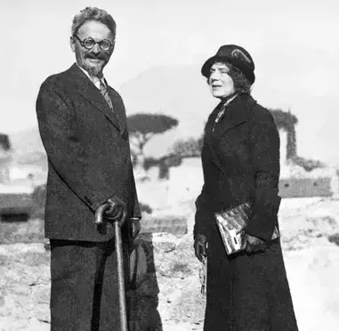

Trotsky's *Permanent Revolution*, in a nutshell, is a theory on how to preserve classless society, also known as the Dictatorship of the Proletariat. Murdered by Ice Pick wielding NKVD agent Ramón Mercader at the order of fellow revolutionary Joseph Stalin, it is interesting to wonder whether Trotsky's ideas could have prevented the over-bureaucratization of the Soviet Union and consolidation of power that occurred after Stalin. Maybe, maybe not.  

<!--

  
*what a guy*

  -->

On a much lighter note, *that kind* of literature has become a seed for my *Theory of Permanent Discomfort*. This is part of my Second Brain project, building a project-based notebook also does time tracking, generates invoices, and helps me improve my productivity.  

For a month now, I've been setting eight daily tasks for myself to complete. That's it! How hard can it be to complete eight tasks? Well as it turns out, somewhat hard to do consistently. Before I wrote this program, I didn't realize how often I was getting distracted by new ideas and projects, and while I haven't improved much in the last month, I now have metrics to measure my progress in this area. Every day, I set up tasks in my notebook: 

</img>  
*A global task list automatically generated from each project's TODO list*

  

As I check them off, a graph is generated that shows my progress that day and displays my average success rate for the previous two weeks:  

</img>  
*Chart shows completed tasks in the last two weeks, and the average completion %*

  

Now that I can measure my Target/Goal ratio, I can make tangible improvements based on my results. I learned from Keto that *you can't make improvements without a way to measure progress.* And as you can see I still have a lot of progress to make. After I make my goal of eight tasks per day, I hope to slowly shore up my productivity and in a year reach 16 completed tasks per day. I expect a critical piece will be managing context switching, which has improved significantly since I started to care about my notebook.  

This brings us to the *carne importante* of this blog post, our *dénouement*: *The Theory of Permanent Discomfort*. Having run this experiment for a month now, I have noticed that I automatically poise tasks on the precipice of what is possible. I have consistently overreached and not made goals that I thought were attainable at the beginning of the day. So I have come to peace with the fact that I will not always make the goals, and allow the day to go uncompleted, even though I could modify the day's tasks to make me always succeed. Some days I find it exceptionally difficult to make all the goals, but having the metrics there keeps me motivated to make them.  

This is Permanent Discomfort - to know that not all goals will be met and to use that bit of failure as motivation to achieve more the next day.  