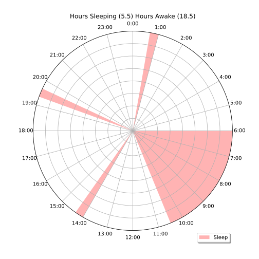

### Day 1
As persistent procrastination precipitates the looming demolition of my happiness, I stare blankly at my computer- The clock strikes 4 in the morning. I have an important deadline tomorrow, and I can't stop reading about polyphasic sleep.  

Most nights I find myself with tasks unfinished, wondering if I should keep working or head in for a full 8 hours and resume the tasks in the morning. Usually, it's the former, and I'll end up cycling my sleep schedule around the clock, chasing the circadians until I'm waking up at 6 PM and all the coffee stores are closed. What a drag!  

But tonight was different, it had to be, I'd delayed this project long enough and I was going to finish it. Like a message from [insert deity], Wikipedia gifted me the perfect answer: Everyman 3 Extended. A significantly more reasonable alternative to the Uberman Polyphasic sleep pattern, Everyman would replace my monophasic 8 hour sleep period with one 4.5 hour period peppered with 3 daytime 20-minute naps, making for 5.5 daily hours of sleep. And that was that! I worked until 6 PM last night and woke up at 10:30 AM.  

And the project got finished! It may just be adrenalin, but it's the first time in a while I didn't feel stressed for time and had to search for things to do. It's why I'm writing a blog for the first time in almost a month!  

### 8-5-2021 - Day 3
To be honest, I haven't done enough research into this Polyphasic sleep thing. It may be a horrible idea- it's been around for a while and there could certainly be some enlightening research on the subject that disqualifies it completely.  

Knowing more is rapidly becoming a priority. I have read that most people before jumping into a polyphasic sleep schedule will plan out the transition ahead of time. I'm a bit too impulsive for that, but I will say that day 3 is going very well!  

It's 3:38 in the morning as I write this. My sleep plan ended up looking like this:

</img>  
*This sleep graph is generated automatically from my calendar program by adding an [ALARM] tag to my TODOs*

  

Red zones mark my sleep periods. This is a pretty messed up perversion of Everyman 3 extended, but it felt the most natural to me. I tend to push my sleep schedule more and more into the night until I'm sleeping at 6 and waking at 3. It's very unideal. Now, I can get the best of both worlds by sleeping at dawn and waking up at 10 AM to get an early start on the day!  

#### Unexpected Consequences of Frequent Napping
By nap #7, I started to fall asleep quickly enough that I would actually dream. These are the kind of in-and-out of consciousness type of dreams I use to have after being totally sleep deprived during my early days in San Francisco. Put on a FlyLo album and drift through the textures of those beats.  

I find that every time I nap (I've completed my 9th nap at this point) I relax enough that the best of the idea of the day will pop in my head. I need to cope with the thought of not writing down the idea until I finish the nap, and usually I've been able to remember it after the alarm goes off  

#### Technology
An unexpected discovery from this experiment has been the time-to-sleep alarm. I've never before set an alarm when it's _time to sleep,_ but it's fantastic! Even for a monophasic sleep pattern, I think it could be really helpful to be alerted when it's time to sleep.  

It fits perfectly with my Digital Soviet Russia idea - even though I have the freedom to do anything and everything, I need to implement structure in my life to get the things I want to do done. The idea is to use technology to read my todos and automatically structure the day around them. With this sleep pattern I know exactly when I will have breaks, and partnered with Pomodoro, I can stay refreshed for the next task.  

#### Fear of the Alarm
Something I've wondered about a lot is _fear of the alarm_. I read somewhere that the reason why people wake up a few minutes before the alarm clock rings is that the sound is extremely stressful to your brain. There must be a section of our brain that keeps time, and just seeing the notification "the alarm is set for 4 hours and 30 minutes from now" is enough to set this internal alarm clock just a few minutes ahead of the silicon one. I would love to experiment with this notification at some point and see what else I can trick my sleeping brain into doing.  

When it comes to napping, some improvement could be made to the alarm. Knowing the alarm will ring so loudly and violently makes it harder to fall asleep. I bet alarm clocks are more abusive to our brains than we realize. An alarm clock should wake you up gently. Gives me ideas for a watch with a vibration motor that connects to my second brain, an auto-scheduling Pomodoro, and this polyphasic sleep timer.  

#### Links
- [polyphasic.net](https://www.polyphasic.net/)
- [Puredoxyk's site, author of _Ubersleep_](http://www.ubersleepbook.com/)
