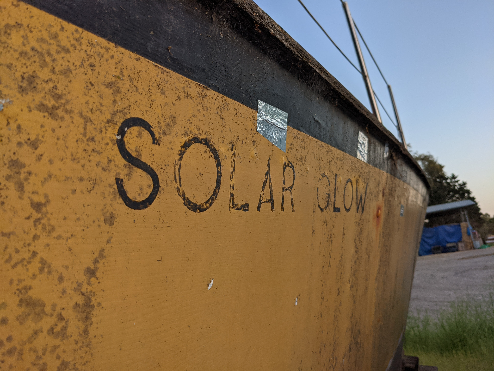

I've got ambitions to cross the Pacific on a solar boat, so I'm looking around for seaworthy multihulls at a good price with no rig or engine. Found a nice Trimaran a few days ago. Good opportunity for a quick trip down to Santa Barbara to check it out! It's a 37ft Piver Searunner.  

I'm starting to see these everywhere. Checked out another one in Alameda a few weeks ago, 25ft. Seems like some guy named Piver popularized these as wood core kits in the 70s?  

So far I'm not impressed. These days, I think wood should never be a building material for a boat. It was fine in the 1700s back before we invented fiberglass...  

But 50 years later every piece of wood on this thing is rotted. Which would be ok if it was just the deck. But the HULLS are rotted too. I did briefly entertain the idea of pulling out all the rotten wood and recoreing it with fiberglass, but it started to sound more and more like the ship of Theseus.  

Now I know I'd much rather find something with a solid fiberglass hull. I want to build things that last a long time, not a big fan of engaging in the building of disposable objects!  

Also... The boat was called the solar glow. if that ain't an omen....  

New plan:
- make a scale model  
- check all the local boat yards and marinas for free cats/tris in the bay  

</img>  
</img>  
