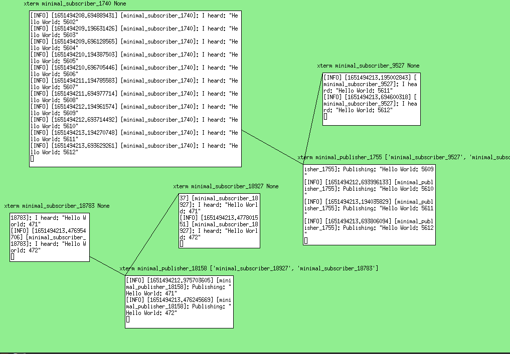

I present: ROSWM! An window manager for ROS2. What's it do? It listens to the currently published ROS2 topics running in your terminal windows and draws a directed graph between them! Like a living RQTgraph!  

It's a proof of concept, written in python because Wayland bindings for python are surprisingly even weirder than xlib. Just wanted to quickly throw something together to improve my ROS2 workflow! Plz appreciate the _lofi_.  

Features I'd like to add:  
- save graph, process list & window locations to a ROS launch file, recall them later  
- multiple desktops, multiple graphs for different parts of the robot like a kicad schematic  

If anyone thinks this is a cool idea, feel free to make a PR to the repo or make suggestions!  

https://github.com/imcnanie/roswm  

</img>  
