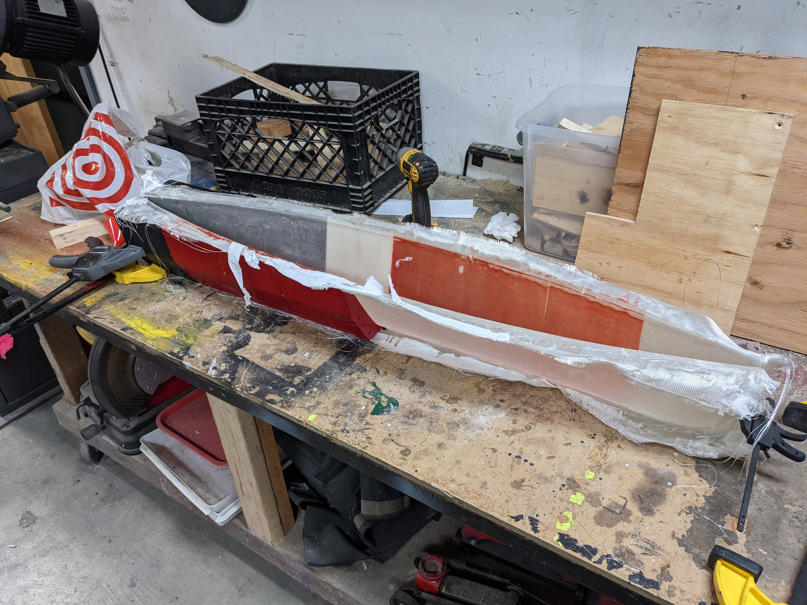

My despisal of multi-ton quadricycles continues, so I've decided to
spend the next week as a humble bicyclist. Since I am a van dweller,
this means I'll need a different place to stay. A perfect opportunity
to get my feet wet bike-camping! I still have lots of projects to
finish, so I'm thinking of finding somewhere to camp over the Golden
Gate, maybe up near Mt. Tam! I've been biking a lot more recently, but
it's mainly been demonstrating how much better shape I could get into,
and I'm pretty hyped about setting up some future long-term bike
trips!

Here's the plan:
- 星期日 do camping research, setup bike!
- 星期一 to 星期五 do the thing, only tenting it up, it may be painful!

Why?
- I know it will be painful, want to prove to myself I can do it
- I slightly don't want to do it, which is a good indication I should do it
- I have a sneaking suspicion that houses, vans, life-boxes isolate
you from the world. I want to evaluate the limit of non-house
dwelling.
- Get ripped (lol), feel good via exercise
- Need to get prepped for longer bike trips
- Sunlight might fix my sleep schedule

Smart things
- Wear sunscreen
- Sunglasses
- Bike light
- High Viz
- Water Bottles
- Hammock w/ bug cover

In other news, the boat mold is turning out excellent. I love
peel-ply. Gives a wonderful fabric-feeling texture to the mold. My 3D
printed mold isn't too smooth, it's making me wonder if I can use
peel-ply on both sides of the mold. Also some _super_ important notes
when vacuum bagging: make sure you use absorptive cloth (i used paper
towels), otherwise the resin pools on the mold side and makes a thick
gel layer, which is just useless weight and looks bad. Also I made a
resin trap out of some pipe because I didn't want to screw up the
vacuum pump. Can't wait to make more stuff, this is a really fun art!

</img>

---
