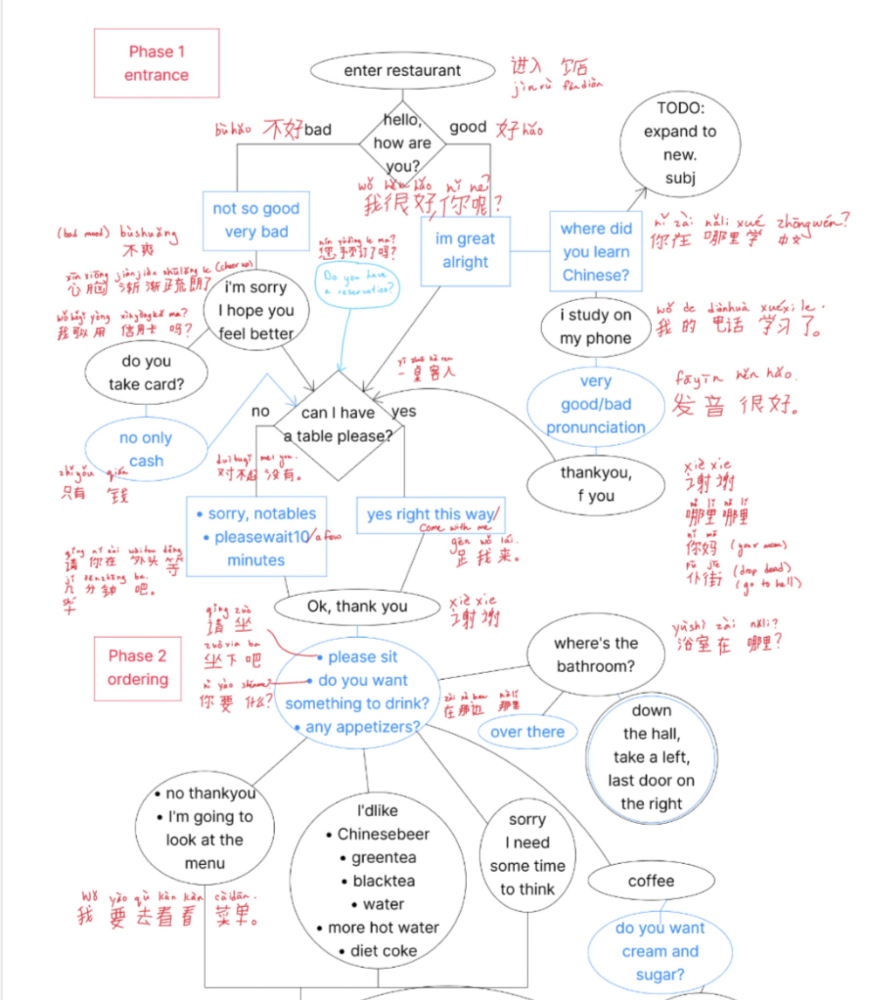
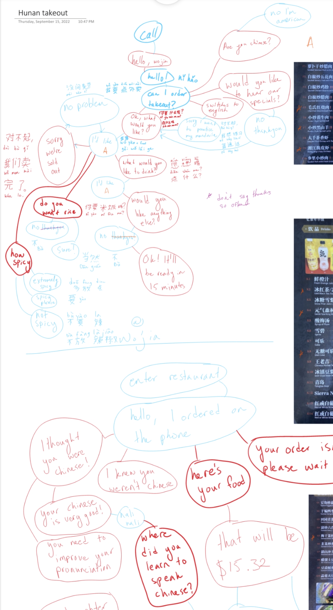
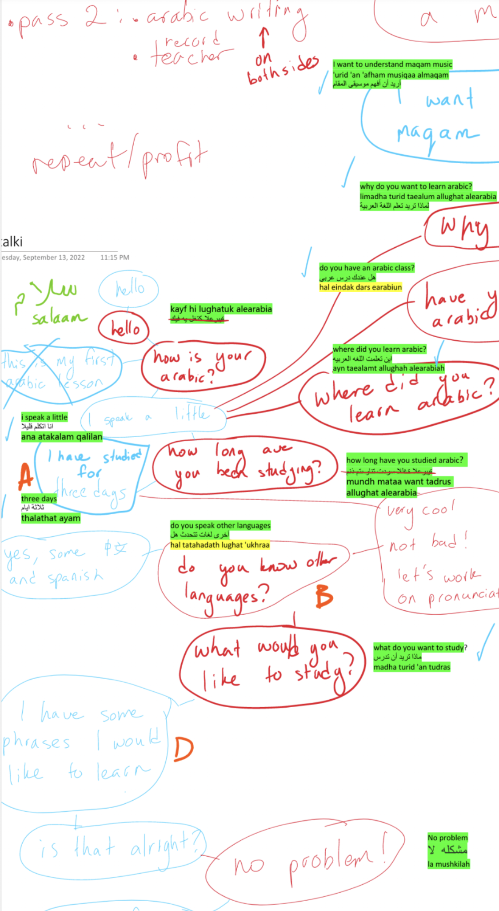

I'm starting my first semester of IRL School! What is IRL School you may
ask? We'll it's just something I just made up... But I assure you it's
quite tight.

You see as a ye olde 大人, I would prefer to continue learning things, and
also improve my learning strategies...

I recently implemented a new learning strategy that has been blowing my
mind. If you've seen the Nathan Fielder's new show _The Rehearsal_, you are
aware of the Fielder method. I won't spoil it, but the Fielder method is
essentially about recreating a detailed rehearsal of the exact situation
you're going to experience, to as much detail as possible.

There's this one shot stuck in my mind:
https://images.app.goo.gl/5hXtMSNtNWmJNPKR6

He built a flowchart to map the entire space of conversation possibilities!
I immediately thought this would be the perfect for language learning. So I
made a couple




Also made one for Arabic, although I still haven't decided if I want to
learn MSA, Egyptian or Darija (Moroccan) Dialect.



I've heard people say that it's best to practice topics, but I didn't
really understand what they meant. It clicked when I saw _The Rehearsal_.
With this method I can practice the specific regimes I'm planning to use my
中文 for, think through and nail all the vocab. The best part is, once I
actually try the actual conversation I can go back and update the flow
chart with the questions I didn't cover.

I'm hoping that this will organize my languages logically and help
reinforce those sweet neurons in a way I can quickly recall the phrases
just by pulling up and brushing up on the flowcharts before I attempt using
the vocab again!

In Steven Pinker's _The Language Instinct_, he mentions something
interesting about how our brains recall vocab:

```How do people home in on the sensible analysis of a sentence, without
tarrying over all the grammatically legitimate but bizarre alternatives?
There are two possibilities. One is that our brains are
like computer parsers, computing dozens of doomed tree fragments in the
background, and the unlikely ones are somehow filtered out before they
reach consciousness. The other is that the human parser somehow gambles at
each step about the alternative most likely to be
true and then plows ahead with that single interpretation as far as
possible. Computer scientists call these alternatives "breadth-first
search" and "depth-first search."
At the level of individual words, it looks as if the brain does a
breadth-first search, entertaining, however briefly, several entries for an
ambiguous word, even unlikely ones.
``` - Steven Pinker's _The Language Instinct_

He's talking about grammar parsing here, but it is interesting to
extrapolate how the brain might use a similar technique for recalling
foreign language vocab. I'm hoping formatting the vocab as a tree matches
how my brain will end up storing the phrases.

So what's IRL School? It comes from step 2 of this graph experiment-
finding real life experiences to practice a concept, potentially
embarrassing myself in the process (risk in lieu of grades). In the case of
language learning, finding restaurants or activities where I can practice
my language, and generate homework/study material to nail that activity.

I think these language maps could be useful in other non-language domains,
like learning music concepts or project organizing, and prove to be a
really helpful tool to master and generate new learning material!
