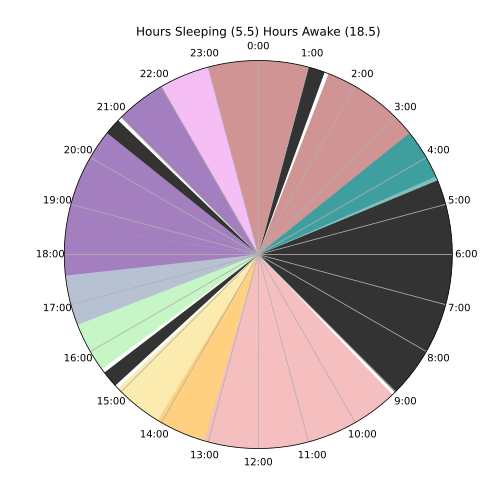
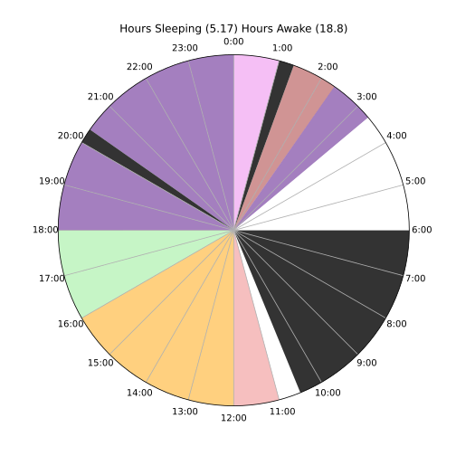
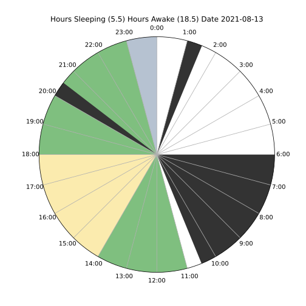
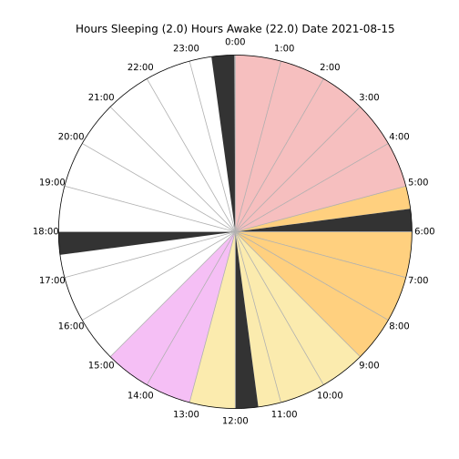
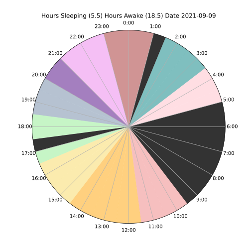
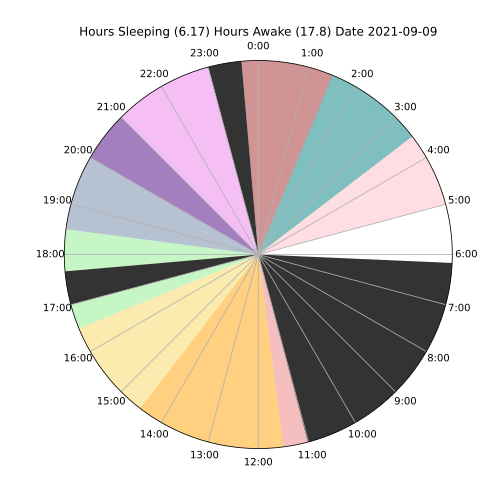
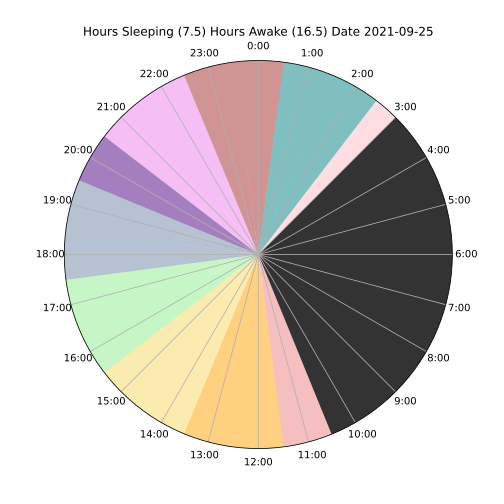

# 8-10-20

## E3-2
- moved bed to a dark closet
- decided to shift first nap back an hour, last night and the night before at 5 I was debilitatingly tired, couldn't even finish watching a movie
- I think because of the extended schedule I'm not tired for the first nap
- I still wasnt tired even an hour later, didn't really sleep at all.
- let's shift E3-1 to 04:00 and wake at 08:00
  - getting up at 06:00 with the sun is kind of fun, but it's becoming disturbing. I am sleeping the best during E3-1 though

## E3-3
- slept better this time, difficult to make my brain switch off idea mode and go to relax mode
- darkness helps a lot
- ate some Peruvian food/fish soup and beigenets pre sleep
- I think the progressively increasing volume thing on sleep timer will improve life/make me hate the alarm less
- need a pillow
- schedule can totally be tuned to nap when most tired, looking forward to tonight's results

## E3-4
- Not tired, sipped some coffee a few hours ago maybe that's the problem
- didn't sleep a wink
- I hope changing my schedule isn't going to cause sleep dep
- I think I need proper bedding for the naps, needs to be comfy af

# 8-11-2021
## E3-1
- Good sleep but woke up rather tired, overslept 15 mins
- reminds me of every day of highschool. I was so sleep deprived :/
- took ferry and rode bike to shop
  - ferries are awesome

## E3-2
- bad sleep, random building creeks and car sounds kept me up
- bailed on nap a few mins early because someone came by

## E3-3 20:45
- 30 mins late to nap
- Much better sleep, the third one is always good
- put on snowblizzard noise makes it easier to fall asleep eliminates freaky wakeup noises

## E3-4 01:50
- Didn't get any sleep but I feel rested
- shifting back naps was a really good call
- now I feel awake enough that I don't need to sleep
- I believe I'm adapting
- let's try an a true E3 day!

# 8-12-2021

## E2-1 06:30
- at 04:00 bicycled like 2.5 miles from shop to Montgomery st bart in sf, got some bread-based food at Starbucks(bad), barted to 12th street Oakland and another mile to the Oakland apartment
- ate some keto ice cream
- overslept by an hour (5.5hrs of sleep), super groggy till I drank lots of coffee
- this core sleep is problematic, makes me want to try true uberman
- switching to E2, 1 core 06:00-10:30, 2 late naps
  - E3 extended means I'm not really sleepy by the first nap

## E2-3
- great nap, got the eye mask
- it's critical to emulate all your most comfortable sleep parameters
  - for example, I know if I wear a mask and listen to sleep sounds, and have the correct sleep clothing, I will fall asleep quickly. The better you match you sleep params across naps, the better you nap (theory)
- I should go on YouTube and see if other people have had success with uberman. I'm already impressed by everyman, but that core nap really screws everything up.
  - setting up the prius sleep pod may reap great improvements as well, for example, by never having to plan to go to the Oakland apartment, hours can be reclaimed and **life can become one continuous day**
  - justification: yes I want to bike to work, but with uberman I can bring my bike places and bike somewhere beautiful instead
- interesting thought, originally I though the extra hours were making me less stressed (more time to get things done), but actually I think it's constant breaks. I don't really feel stressed about anything and it always feels like I have enough time to calculate my next move
- I've also experienced a few cases where the naps weren't disruptive, but instead I think my friends appreciated it, it gave them time to relax and do their own thing for a few minutes. This was surprising.

## E2-4
- nice nap, but definitely no sleep
  - wasn't tired enough again
  - maybe this nap is too close to previous nap or it's because I overslep on E3-1
- I'm thinking maybe no to uberman right now, it's seems pretty extreme
  - I'm getting very adequate sleep from this current schedule
  - Maybe we'll do 0.5-1hr less core, but let's do a couple days first with this E2 Schedule

# 8-13-2021

## E2-1
- happy Friday the 13th!
- overslept by an hour
- perhaps I should try true E3 tomorrow (3hr core)

## E2-2
- This day feels long, but effective
- upping the nap lengths to 30mins from 20
- this will give me some buffer to actually fall asleep
- just slept from 21:30-22:00 boy I feel rested!
  - could Buckminster Fuller have something?! (Duh)
  - I'd rather trust him than random internet people
- would be fun to get a brain monitor/make one and monitor the slow wave sleep.
- also do interesting experiments like making the clicking sound at the peaks of slow wave and logging how much slowwave/rem I'm getting
- made some cold brew it's going to be excellent
- mood: 10

## E2-3
- didn't sleep much, too excited about my project, if core goes over target, should really skip one of the naps.
- 30 mins is nice though
- mood: 8.5

# 8-14-2021
## E2-1 05:30-10:00
- went to bed early, barely could stay awake 
- had a dream where I got shot in the heart and it was the 90s, I was seemingly fine, but I was also really concerned I was going to die. No blood, just schlooped in there.
- we were at the Hereford house and mom was too distracted by her smartphone to put the SNES emergency services cartridge in the console. I was clearly dieing, but at a very slow rate. As I became weaker and more stressed out I would keep asking her to call the hospital via SNES. Eventually woke up and did not die.
- woke up very groggy but set my phone screen and flashlight to full brightness and shined it in my eyes to wake me up. Surprising side effect of writing logs is the bright screen's ability to wake me up. Should probably be less annoying about bugging people with phones
- mood: 6.5

## E2-2 20:32-21:05
- Good deep sleep, was pretty tired going into it so it felt necessary, definitely the deepest I've napped
  - man I wish I had some sleep sensors
- chasing the dragon pretty hard with caffeine these days
  - time out of mine steely dan
- coming out of it still feel tired, maybe 30 min naps will clean up the sleep debt
- mood 4.5

## E3-3 2:20-2:35
- Not really tired, bailed sleep early
- We are now going to attempt a dymaxion schedule
- keeping the naps is extremely important, blacking out the prius is now highest prio

# 8-15-2021

- **Dynamaxion Commence!**
- the idea is to never let self get tired, sleep before that happens. 
- Four naps is the target, but if extremely tired, feel free to take an extra nap
  - **Each nap MUST be 30 mins**
  - **Primary Naps must be strictly adhered to**

## D4-1
- first nap, feeling good, a bit tired, cooking up some cafe
- did sleep, alarm went off 5 mins early, reorganized alarms

## D4-2
- feeling pretty groggy and pretty tired but that's just due to waking up during SWS
- Good amount of nap

## D4-3
- still pretty awake, having trouble falling straight into the nap, didn't sleep much

## D4-4/E2-1
- didn't even make it to this nap, instead I slept for 6 hours, it was becoming pretty painful. 
- Waking up mid-sws really is pretty difficult.
- maybe this schedule with 2 extended nap periods would be better
- not having a primary sleep period is kinda sad
- reverting to E2

# 8-16-2021

- I've decided to stick with E2 until October 1st until I convert to E3. Advice on polyphasic.net says people generally have more success switching to E3 after several months of E2

## E2-2 00:30
- didnt initiate sleep on time due to distraction
- 30 min nap
- pretty groggy and rather tired but no problems waking up
- mood 6.9

# 8-17-2021
## E2-1
- overslept by one hour

## E2-2
- slept about 15 mins
- felt pretty rested
- mood 7.4

# 8-18-2021
##  E2-1
- overslept by 30 mins (intentionally working my way back to 4hr30)
- very groggy at wakeup
- wake self up with flashlight in my eyes
- mood 8

# 8-20-2021
## E2-3
- slept in Prius in front of the shop
- don't have blackouts on the windows yet
- did my best to nap, but cops and many other sounds meant I didn't really sleep
- Prius had potential though, it's like the van lite
- going to install blackout curtains now

# 8-28-2021
## E2-1
- overslept by 3 hours
- missed last night's naps
- not sleeping consistently enough
- how can I expect adaptation if I don't adhere precisely to a schedule?
- interesting dream about being a nurse, starting my first day in a hospital, mom showing me around. Theres a door right before the emergency room that leads down a dark staircase into a massive city of ember esque cenote. As I climb down the steps, the sky becomes more blue. There are lots of people and the scene turns into a beach before I get down to the bottom. I follow the shore to an old church ruin where a see a giant black hemi truck trailering a castle. It is intimidating. Not sure if it is friendly, I pause, but it opens fire and suddenly there are explosions everywhere. I jump behind the church ruin onto my stomach but hellfire is still raining down. I decide to make a run for it back to the wooden staircase far on the other side of the beach. I think about taking advice about running perpendicular to the attack, like a chicken but ignore the advice and continue running towards the wooden stairs. I am running full speed and I fear they will be destroyed before I make it. Half across the beach the alarm goes off and I wake up.

## E2-2
- nice nap, super tired, ate some dank pizza my bro made but I got tired from carbohydrate.
- Felt heavy strain in my upper chest, not pain, but an interesting pressure
- great sleep, almost failed and slept an extra 10 mins, but writing this and the previous log saved me and I've now woken up fully
- hyped to get back on this schedule
- mood: 7

## E2-3
- about an hour late to sleep (2:20)
- not too tired, but residual carbohydrates in my mouth created an uncomfortable sleep environment
- loud dishwashing noises downstairs making it difficult to sleep
- also excited about an idea to split Holdsworth scales into 2 4nps sections L&R Chiral
  - counterpart to Dorian is mixolydian
  - assign each scale to a Chinese character

# 8-29-2021
## E2-1
- overslept by 30 mins, went to bed an hour early
- missed the rest of the days naps
- really negative day, but there were some learning lessons
- need to really work on focusing on other people over myself
- muddy water is cleared best by leaving it alone -Allan Watts
- mood: 6-3

# 8-30-2021
## E2-1
- overslept by 1hr
- missed yesterday's naps
- mood 8

## E2-2
- late to sleep by 30 mins
- very tired
- didn't actually fall asleep but refreshing
- mood 8

# 9-1-2021
## E2-2
- Got to nap on time for the first time in a long time
- sleeping on hard ground hurts my fingers and toes
- does caffeine make it hard to focus?

# 9-8-2021

- feeling very tired but less lethargic than last time I was down here (I flew back to Central America)
## E2-1
- woke up an hour early due to heat and noise
- El Salvador is an hour later anyway, so I'm going to shift the schedule back an hour- E2-1 to 5-9:30

## E2-2
- went on a grueling hike, napped from 17:00-21:00
- going to make 17:00 E2-2

## E2-3
- Not sure where I'm going to put this yet, skipping this nap due to the long E2-2 today
- mood 6.5

# 9-9-2021

- adding 20 mins buffer to each sleep segment to account for time it takes to fall asleep
## E2-1
- 6hrs of sleep, woke up cause it got too hot

## E2-2
- Slept at 17:00 for 40 mins

## E2-3
- Slept at 23:00 for 40 mins
- moving nap back a bit
- I think there's something to this 20min nap cycle thing. 30mins is too little/too much. Gotta stick with naps that are multiple of 20 mins
- makes me wonder about 4-6 40min dynamaxion naps
  - yeah it exists, see triphasic sleep and core only

# 9-26-2021

- Honduras is too hot to sleep during day
- car problems mean I can't nap consistently
- loud sounds everywhere
- reverting back to monophasic sleep
- experiment ends

