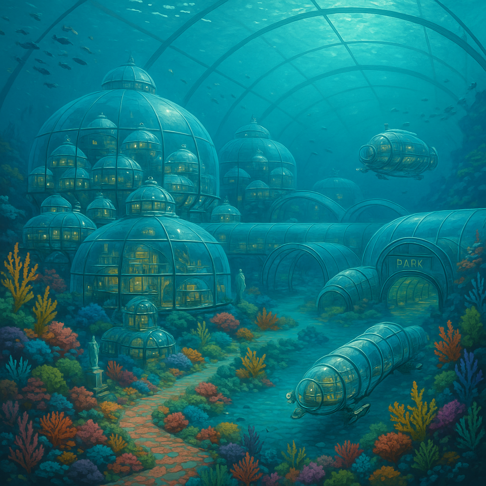

# Building an Underwater City

Preliminary plans for building an underwater city.

1. Generate significant capital to acquire necessary resources by mapping the Ocean with ROVs  
2. Build human submarine modules capable of ocean exploration, science, and permanent habitation  
3. Live full time underwater, explore the new frontier of the underwater world!

| Underwater House                                   | Underwater City                                   |
| :-------------------------------------------------: | :-------------------------------------------------: |
|  |  |

---

Year 27: Learn CNC Plasma Cutting and Welding, begin designing a long‑range ROV, start an underwater city Discord, actively use Twitter and gather a community, fix up van and sell it

May 2025

Week ending May 11, 2025 (Rest of This Week)

- **Friday, May 9, 2025 (Today):**  
  Draft a concise mission statement for your long‑range ROV project, outlining its primary task (ocean floor mapping).  
  &rarr; Let’s build “street‑view” for the ocean—capture hydrothermal vent money shots!

- **Saturday, May 10, 2025:**  
  Research and list 3–5 existing long‑range ROVs, noting key features; confirm you have textbooks/access codes for your college courses.

- **Sunday, May 11, 2025:**  
  Sketch 2–3 rough initial concepts for the ROV’s shape/layout; double‑check start date/time/location for your classes.

Week of May 12–18, 2025 (Next Week)

- **Monday, May 12:** List the top 5 essential capabilities your ROV must have (depth rating, sensors, endurance, etc.).  
- **Tuesday, May 13:** Identify challenges for each capability (pressure, power, data handling).  
- **Wednesday, May 14:** Plan your commute to campus; confirm parking or transit.  
- **Thursday, May 15:** Research sonar/camera sensors for ocean‑floor mapping.  
- **Friday, May 16:** Organize digital folders or physical notebooks for coursework.  
- **Saturday, May 17:** Brainstorm 3–5 KPIs for your ROV (survey speed, resolution).  
- **Sunday, May 18:** Pack supplies for your first day of classes.

Week of May 19–25, 2025 (Following Week)

1. **Monday, May 19:** Sketch a block diagram of ROV systems (power, propulsion, sensors, comms).  
2. **Tuesday, May 20:** List channels/categories for your Discord (e.g., #announcements, #rov‑design).  
3. **Wednesday, May 21:** Research power‑system options for long‑endurance ROVs.  
4. **Thursday, May 22:** Draft a welcome message and rules for Discord.  
5. **Friday, May 23:** Research communication/control methods for ROVs.  
6. **Saturday, May 24:** Define initial Discord roles (moderator, ROV expert).  
7. **Sunday, May 25:** Review your sketches and block diagram; note open questions.

Week of May 26–31, 2025 (Last Week of May)

- **Monday, May 26 (Memorial Day):** Write a one‑page ROV concept summary (mission, features, challenges).  
- **Tuesday, May 27:** Find 1–2 online ROV/ocean‑exploration forums to join.  
- **Wednesday, May 28:** Review course syllabi; note questions.  
- **Thursday, May 29:** Organize your study/design workspace.  
- **Friday, May 30:** Set personal goals for Month 1 of welding/metalworking.  
- **Saturday, May 31:** Rest and mentally prepare for classes.

June 2025

Immerse yourself in **Introduction to Welding** and **Introduction to Metalworking**, focus on fundamentals, and launch your underwater city Discord server.

July 2025

Continue coursework, apply welding/metalworking concepts to ROV design (material selection, fabrication considerations), and grow your Twitter presence.

August 2025

Complete summer courses, solidify skills, and refine your ROV’s manufacturability using new welding/CNC knowledge.

September 2025

Begin fall focus on CNC; design frame and structural components of the long‑range ROV, planning CNC plasma‑cut parts.

October 2025

Advance CNC skills; design complex components (electronics enclosures, mounting systems), and engage your Discord/Twitter communities.

November 2025

Integrate CNC and welding knowledge; finalize ROV structural/mechanical designs; source materials and components.

December 2025

Plan Q1 2026 fabrication of your first ROV prototype; expand your network; seek collaborators and mentors.

---

Year 28: Autonomously map a large section of the ocean, seeking shipwrecks and scientific discoveries (“Google Street View for the Ocean”)

- Set up mapping missions.  
- Develop autonomy algorithms.  
- Collect and analyze data for new frontiers.

---

Year 29: Scale production to 100 ROVs/year; use them to identify underwater habitat sites near volcanically active areas for power generation

- Optimize manufacturing pipeline.  
- Plan site surveys.  
- Evaluate locations for first habitat.

---

Year 31: Begin production of very large polycarbonate domes

- Design structural specs.  
- Prototype dome sections.  
- Test pressure resilience.

---

Year 32: Master dome construction for large human‑carrying submarines

- Refine joining techniques.  
- Integrate life‑support interfaces.  
- Conduct sea trials.

---

Year 33: Explore the ocean commercially and sell human‑carrying subs

- Launch prototype tours.  
- Gather customer feedback.  
- Scale sales operations.

---

Year 35: Increase dome size; complete first self‑sustaining underwater habitat with detachable tailcone for hydrodynamic mobility

- Finalize habitat systems.  
- Build prototype habitat‑sub.  
- Sea‑trial performance.

---

Year 36: Outfit habitats with full living amenities; lease for scientific missions and West‑Coast eco‑hotel

- Install life‑support.  
- Partner with research institutions.  
- Market eco‑stay packages.

---

Year 37: Scale habitat production to 100 units/year

- Streamline assembly.  
- Secure supply chains.  
- Train workforce.

---

Year 38: Deploy modular habitats to volcano‑proximate locations for geothermal power

- Map volcanic sites.  
- Plan logistics.  
- Install power systems.

---

Year 39: Build basic “town” infrastructure and powerplant

- Lay underwater cables.  
- Set up communal facilities.  
- Commission powerplant.

---

Year 40: …and beyond

*Continue expanding the underwater city, adding research labs, tourism modules, and long‑term sustainability projects.*

